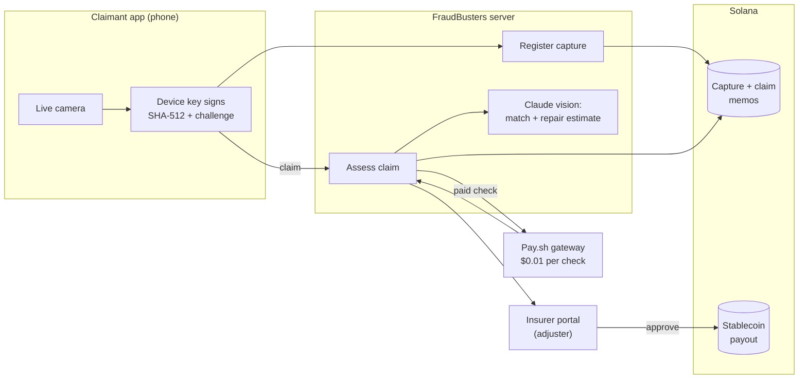
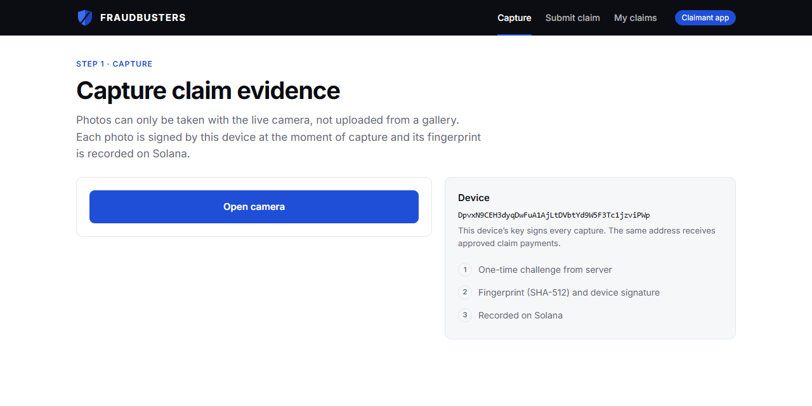

<p align="center">
  
</p>

<h1 align="center">FRAUDBUSTERS</h1>

<p align="center">
  <b>Know a claim photo is real before you pay it.</b><br />
  Verified insurance-claim evidence on a shared Solana registry that no single insurer controls.
</p>

<p align="center">
  
  
  
  
</p>

<p align="center">
  Built in one day at <b>BUILD IRL Vol. 1</b>, Dublin, September 2026<br />
  (Superteam Ireland × Claude Builder Club @ Trinity College Dublin × Solana)
</p>

---


## The problem

Generating a convincing photo of a dented car door now takes seconds. Detection tools try to spot the fake and lose the arms race each time image generators improve. Meanwhile, the same genuine photo can be claimed at two insurers, and a real scratch can be claimed as a €2,000 repair, and no single insurer can see it.

## The approach: four questions before anyone pays

FraudBusters doesn't guess whether a photo is fake. It **proves** where a photo came from, checks it against the whole market, and gives the adjuster a reason for every finding.

| | Question | How FraudBusters answers it |
|---|---|---|
| 01 | **Is it real?** | Live camera only (no gallery uploads). The phone signs the photo against a one-time server challenge; the fingerprint and signature are anchored on Solana. |
| 02 | **Is it new?** | The photo is matched against every claim on the shared registry, even after compression, plus the claimant's claim history across *all* insurers. |
| 03 | **Does it add up?** | Claude reads the photo: does it show what the claim describes, and is the amount plausible for the visible damage? Inflated claims get flagged. |
| 04 | **Settled?** | The adjuster approves and a stablecoin payment settles in seconds, with the decision recorded in the same Solana transaction. |


<p align="center"><sub>A claim file in the insurer portal: the same photo was already claimed at another insurer, caught through the shared registry.</sub></p>

## Why Solana

Competing insurers will never put their claims evidence into a database a rival owns. A public ledger that nobody owns and nobody can backdate is what makes a shared fraud registry possible.

| Role | On-chain | Code |
|---|---|---|
| **Proof of capture** | Memo transaction with SHA-512 + perceptual hash, device public key, ed25519 signature and capture challenge | [`POST /api/register`](src/server.js) |
| **Shared fraud registry** | Every claim registered as a memo; reuse and claimant history detected across insurers | [`POST /api/claims`](src/server.js), [`scripts/reindex.js`](scripts/reindex.js) |
| **Settlement** | Stablecoin transfer and decision memo in one atomic transaction on adjuster approval | [`payout()`](src/solana.js) |
| **Pay-per-check API** | Verification endpoint behind a Pay.sh gateway: $0.01 USDC per request over HTTP 402, no account or API key | [`paywall.yml`](paywall.yml), [`src/payClient.js`](src/payClient.js) |

Photos never go on-chain; only fingerprints and signatures do. The local index is a cache that can be rebuilt from the chain alone.

## Architecture



## Features

**Claimant app**
- Live-camera-only capture with a server challenge, so photos can't be pre-made or picked from the gallery
- On-device ed25519 key: the same address that signs the evidence receives the payout
- Claims with status-only receipts: fraud signals are never shown to claimants
- Live claim tracking; approved payments arrive within seconds



**Insurer portal**
- Triaged queue (verified, standard review, flagged) with a reason for every finding
- Evidence checks: capture record, integrity (SHA-512), live capture, claimant = capturing device, reuse across insurers, claimant history, photo vs description, amount vs estimated repair cost, AI-generation labels (C2PA / IPTC / generator metadata)
- Upload tier for photos taken elsewhere: metadata signals and reverse image search via Google Cloud Vision, paid per request through the Pay.sh catalog
- One-click approve-and-pay or reject, both recorded on Solana

**Engineering details**
- 64-bit perceptual hash (dHash) survives messaging-app compression and resizing; SHA-512 proves byte-level integrity
- Claude assessment returns schema-validated structured output; claimant text is treated strictly as data (tested against prompt injection)
- End-to-end test covering capture, claim, approval, double claim, rejection and compressed-copy verification ([`scripts/e2e.js`](scripts/e2e.js))

## Tech stack

| Layer | Technology |
|---|---|
| Chain | Solana (Memo program, SPL Token), `@solana/web3.js`, `@solana/spl-token` |
| Payments | Pay.sh gateway and CLI (HTTP 402, USDC) |
| AI | Claude (Anthropic SDK, vision + structured outputs) |
| Server | Node.js 24, Express 5, sharp, tweetnacl, exif-reader |
| Frontend | Vanilla HTML/CSS/JS, browser camera API (getUserMedia), no build step |

## Getting started

```sh
npm install
npx pay --version            # downloads the Pay.sh binary on first run
npm run setup                # keypairs, SOL for fees, test stablecoin
npm run cert                 # self-signed HTTPS cert (phone cameras require HTTPS)
npm run dev                  # http://localhost:3000 and https://<LAN-IP>:3443
npm run gateway              # Pay.sh gateway on :1402, with payment debugger
node scripts/e2e.js          # end-to-end test
```

Configuration lives in `.env`:

| Variable | Purpose |
|---|---|
| `RPC_URL`, `CLUSTER` | Solana RPC (defaults to devnet) |
| `ANTHROPIC_API_KEY` | Enables the Claude photo assessment |
| `PAYOUT_MINT`, `PAYOUT_SYMBOL` | Payout stablecoin, e.g. USDC or EURC (setup creates a test token otherwise) |
| `REVERSE_SEARCH=on` | Enables Google Vision reverse image search via Pay.sh (mainnet account required) |

Open `/capture.html` for the claimant app and `/adjuster.html` for the insurer portal.

## Project structure

```
src/
  server.js         API: capture, claims, triage, adjuster decisions, claimant/insurer views
  solana.js         memo writes, atomic payout + decision transaction
  contentCheck.js   Claude photo assessment (match, damage, repair estimate)
  signals.js        AI-generation labels and metadata signals
  payClient.js      Pay.sh-paid registry checks and reverse image search
  phash.js          perceptual hashing
  store.js          local index (rebuildable from chain)
public/             claimant app and insurer portal
scripts/            setup, e2e test, chain reindex, TLS cert, gateway supervisor
paywall.yml         Pay.sh gateway definition
```

## Roadmap

- **Native capture app** with hardware-backed keys (Secure Enclave / Android Keystore) and Apple App Attest / Google Play Integrity, so only genuine devices can sign evidence
- **Anti-replay capture**: multi-angle sequences, depth and screen-pattern (moiré) checks against photos of screens
- **Damage-level AI**: per-part damage classification and severity grading
- **Mainnet settlement** in EURC for euro claims, and insurer sign-in with role-based access
- **C2PA interoperability**: issue Content Credentials alongside the on-chain record
- **Pay.sh catalog listing** so any claims agent can discover and buy verifications

The current build runs on a Solana test network with fictional insurers and a test stablecoin.
