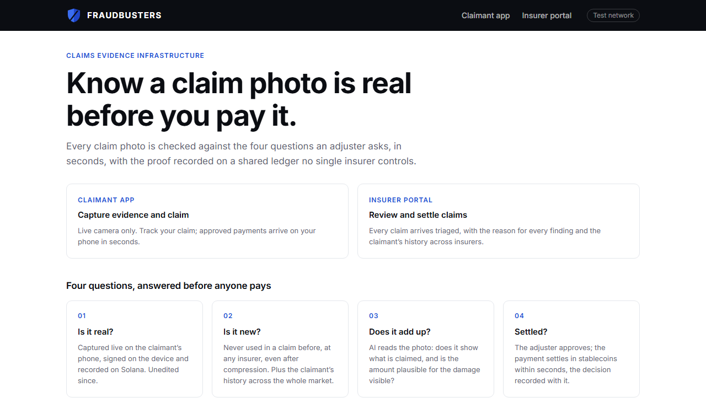
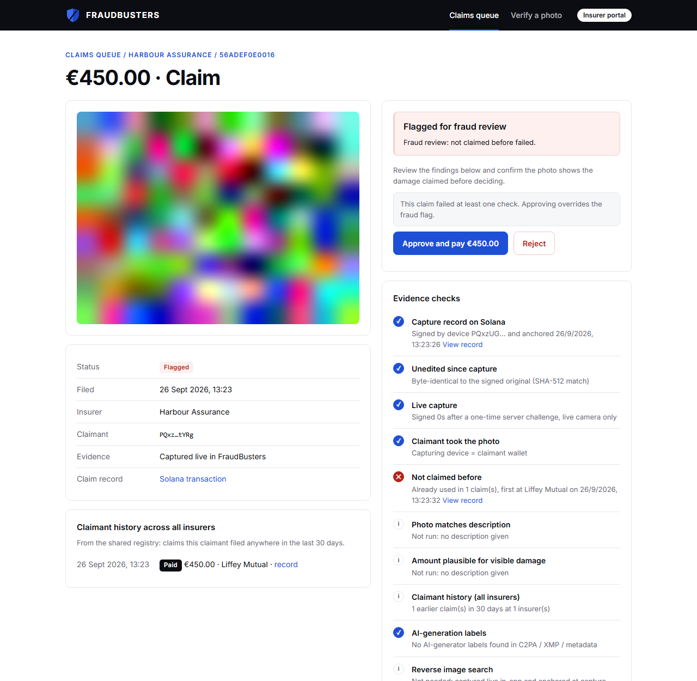
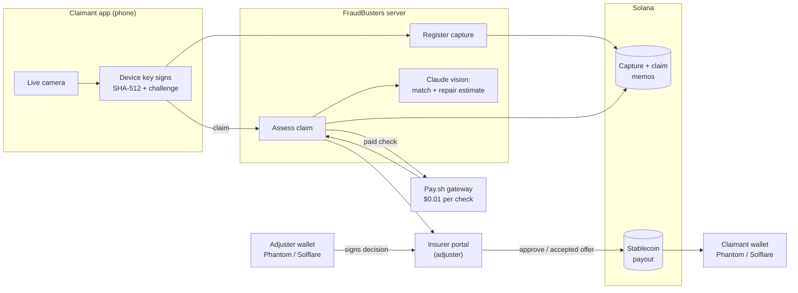
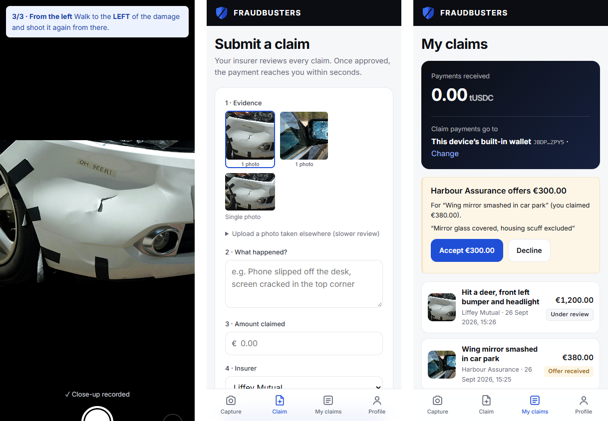
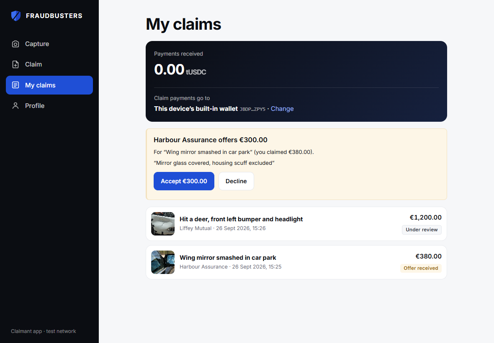

<p align="center">
  
</p>

<h1 align="center">FRAUDBUSTERS</h1>

<p align="center">
  <b>Know a claim photo is real before you pay it.</b><br />
  Verified insurance-claim evidence on a shared Solana registry that no single insurer controls.
</p>

<p align="center">
  
  
  
  
</p>

<p align="center">
  Built in one day at <b>BUILD IRL Vol. 1</b>, Dublin, September 2026<br />
  (Superteam Ireland × Claude Builder Club @ Trinity College Dublin × Solana)
</p>

---

| | |
|---|---|
| **Live demo** | https://faces-pioneer-fate-day.trycloudflare.com (claimant app: [`/capture.html`](https://faces-pioneer-fate-day.trycloudflare.com/capture.html), insurer portal: [`/adjuster.html`](https://faces-pioneer-fate-day.trycloudflare.com/adjuster.html)). Served from our laptop during the event, so it is only up while that runs. |
| **Code** | https://github.com/EmuCS/solanahackathon |
| **On-chain proof** | Real transactions from today's build, listed [below](#on-chain-proof) |

### Try it

- **Claimant app** (open on a phone): https://faces-pioneer-fate-day.trycloudflare.com/capture.html
- **Insurer portal** (open on a laptop): https://faces-pioneer-fate-day.trycloudflare.com/adjuster.html

**As the claimant, on your phone**
1. Open the claimant link. Optional: Share → **Add to Home Screen** to use it as an app.
2. **Capture** → **Start guided capture** → allow the camera → take the three shots it asks for: wide, close-up, then from the side it names.
3. Tap **Submit a claim with these photos**, describe the damage, enter an amount, pick an insurer and **Submit claim**.
4. Optional: **Profile** → **Connect Phantom** (or Solflare) so payments go to your own wallet. On iPhone, tap **Open in Phantom** and approve there.

**As the adjuster, on your laptop**

5. Open the insurer link. Your claim appears in the **Claims queue** about 20 seconds after submitting, once the AI check finishes. Open it.
6. Review the damaged parts with severity, the evidence checks and the Solana records for each shot.
7. Click **Connect Phantom** (or Solflare), which needs the browser extension. Then either keep the full amount and click **Approve and pay**, or lower it to **Send offer**, or click **Reject**. Approve the message in your wallet.

**Back on the phone**

8. **My claims** shows the decision. For an offer, tap **Accept**: the payment settles in seconds and the balance updates, with a link to the payment on Solana.

Things to try: submit the same photos again, or to the other insurer (flagged as reuse); photograph a screen showing a photo (flagged as screen or print); claim €2,000 for a small scratch (flagged as likely inflated).



## The problem

Generating a convincing photo of a dented car door now takes seconds. Detection tools try to spot the fake and lose the arms race each time image generators improve. Meanwhile, the same genuine photo can be claimed at two insurers, and a real scratch can be claimed as a €2,000 repair, and no single insurer can see it.

## The approach: four questions before anyone pays

FraudBusters doesn't guess whether a photo is fake. It **proves** where a photo came from, checks it against the whole market, and gives the adjuster a reason for every finding.

| | Question | How FraudBusters answers it |
|---|---|---|
| 01 | **Is it real?** | Live camera only (no gallery uploads), in a guided three-shot set: wide, close-up, and a side the server picks at random. Each shot is signed by the phone against a one-time server challenge and anchored on Solana. Claude checks that all shots show the same object and flags photos of a screen or print. |
| 02 | **Is it new?** | Every shot is matched against every claim on the shared registry, even after compression, plus the claimant's claim history across *all* insurers. |
| 03 | **Does it add up?** | Claude lists each damaged part with the type of damage and its severity, checks the photos against the description, and estimates a repair range. Inflated claims get flagged. |
| 04 | **Settled?** | The adjuster signs the decision with their Phantom or Solflare wallet: pay in full, or send a lower offer the claimant can accept. The stablecoin payment reaches the claimant's wallet in seconds, with the decision recorded on Solana. |


<p align="center"><sub>A claim file in the insurer portal: three-shot evidence set, damaged parts with severity, and a flag because the close-up was already used in an earlier claim.</sub></p>

## Why Solana

Competing insurers will never put their claims evidence into a database a rival owns. A public ledger that nobody owns and nobody can backdate is what makes a shared fraud registry possible.

| Role | On-chain | Code |
|---|---|---|
| **Proof of capture** | Memo transaction with SHA-512 + perceptual hash, device public key, ed25519 signature and capture challenge | [`POST /api/register`](src/server.js) |
| **Shared fraud registry** | Every claim registered as a memo; reuse and claimant history detected across insurers | [`POST /api/claims`](src/server.js), [`scripts/reindex.js`](scripts/reindex.js) |
| **Wallet sign-off** | Every approve, offer or reject is signed by the adjuster's Phantom / Solflare wallet; the wallet address and signature go into the decision memo | [`POST /api/claims/:id/decision`](src/server.js), [`public/wallet.js`](public/wallet.js) |
| **Payout wallet** | Claimants link their own Phantom / Solflare wallet (signed by both the phone and the wallet), recorded as a memo | [`/api/link/*`](src/server.js), [`public/profile.html`](public/profile.html) |
| **Settlement** | Stablecoin transfer and decision memo in one atomic transaction | [`payout()`](src/solana.js) |
| **Pay-per-check API** | Verification endpoint behind a Pay.sh gateway: $0.01 USDC per request over HTTP 402, no account or API key | [`paywall.yml`](paywall.yml), [`src/payClient.js`](src/payClient.js) |

Photos never go on-chain; only fingerprints and signatures do. The local index is a cache that can be rebuilt from the chain alone.

### On-chain proof

Real transactions written by today's build (Solana test network run by Pay.sh; the explorer links open it as a custom cluster):

| What | Transaction | Memo |
|---|---|---|
| Capture record (wide shot of a three-shot set) | [QQefR5HT…](https://explorer.solana.com/tx/QQefR5HTEG8QiAwZedTXyVZCQ4AYEJ3B5xe6SersTFr7fAdkvxV8HDq7fbHJcrMqau8mVMyvArDRogvVkHucvPS?cluster=custom&customUrl=https%3A%2F%2F402.surfnet.dev%3A8899) | `fraudbusters:photo:v1` · perceptual hash · SHA-512 · device key · signature · challenge · set/shot |
| Claim registered on the shared registry | [3q5aT2dP…](https://explorer.solana.com/tx/3q5aT2dP7yzoMP4jNaHmvowhxTEJh5p3Bw1hL2nQV2M5Mo2jopgCvxVJkYpXVqeh4rBqsA77d5qg4tgb9sDMSvih?cluster=custom&customUrl=https%3A%2F%2F402.surfnet.dev%3A8899) | `fraudbusters:claim:v1` · hash · insurer · status · amount · claimant |
| Payout wallet linked from an iPhone with Phantom | [Y5MeP7a8…](https://explorer.solana.com/tx/Y5MeP7a83RS7GAzifQjCg64bAhe6X37PfAuyC5EjYrqEaULX9TXSpudEKhLcNcrenvxkavsb77UPQ2gswZNx3ZP?cluster=custom&customUrl=https%3A%2F%2F402.surfnet.dev%3A8899) | `fraudbusters:link:v1` · device · wallet · wallet signature |
| Adjuster decision signed in Phantom | [2UJDPJef…](https://explorer.solana.com/tx/2UJDPJefatQpZSCbQ5CotMATdvs6wyN7YighWJ5SazLtgVc63coom5JqxwQ2ksS8S6VoP6jyF3ReoTWas2Nb9Wmz?cluster=custom&customUrl=https%3A%2F%2F402.surfnet.dev%3A8899) | `fraudbusters:claim:v1` · decision · adjuster wallet · adjuster signature |
| Stablecoin payout (700 tUSDC after an accepted offer) | [33emXq6i…](https://explorer.solana.com/tx/33emXq6iA3HE3cZ7Wqd3bVdBRJ2CRu5F3S1k1wmrMkqjFYQ772BWo9jTSiMboeehywnAT9snm1EnaNg4LyMNNvE6?cluster=custom&customUrl=https%3A%2F%2F402.surfnet.dev%3A8899) | token transfer + `fraudbusters:claim:v1` · paid |

## Architecture



## Features

**Claimant app** (installable on iPhone and iPad from the browser: Share → Add to Home Screen)
- Guided three-shot capture (wide, close-up, random left/right side), live camera only, full-screen on phones and tablets
- Each shot signed on the device against a one-time server challenge and anchored on Solana
- Connect Phantom or Solflare in Profile to receive payments in your own wallet (works on iPhone via the wallet app's browser)
- Offers from the insurer arrive in My claims; accepting is signed by the device and pays out in seconds
- Status-only receipts: fraud signals are never shown to claimants
- App layout: bottom tab bar on phones, fixed sidebar on tablets and computers


<p align="center"><sub>iPhone: guided capture (shot 3 of 3), claim form, and My claims with an offer from the insurer.</sub></p>



**Insurer portal**
- Triaged queue (verified, standard review, flagged) with a reason for every finding
- AI damage assessment: each damaged part with damage type and severity (minor / moderate / severe), plus a repair range
- Evidence checks: capture record, integrity (SHA-512), live capture, claimant = capturing device, three-shot set (same device, distinct shots, one session), same object in every shot, real scene vs screen or print, reuse across insurers (every shot), claimant history, photo vs description, amount vs estimated repair cost, AI-generation labels (C2PA / IPTC / generator metadata)
- Upload tier for photos taken elsewhere: metadata signals and reverse image search via Google Cloud Vision, paid per request through the Pay.sh catalog
- Pay the full amount, send a lower offer with a note, or reject; every decision is signed with the adjuster's wallet and recorded on Solana

**Engineering details**
- 64-bit perceptual hash (dHash) survives messaging-app compression and resizing; SHA-512 proves byte-level integrity
- Claude assessment returns schema-validated structured output; claimant text is treated strictly as data (tested against prompt injection)
- Wallet decisions are server-issued, human-readable messages bound to claim, action, amount and payee; changed amounts, other wallets' signatures and replays are refused
- End-to-end test covering capture, claim, wallet-signed approval, double claim, rejection and compressed-copy verification ([`scripts/e2e.js`](scripts/e2e.js))

## Tech stack

| Layer | Technology |
|---|---|
| Chain | Solana (Memo program, SPL Token), `@solana/web3.js`, `@solana/spl-token` |
| Payments | Pay.sh gateway and CLI (HTTP 402, USDC) |
| AI | Claude (Anthropic SDK, vision + structured outputs) |
| Server | Node.js 24, Express 5, sharp, tweetnacl, exif-reader |
| Wallets | Phantom and Solflare (injected providers, message signing; deep links into the wallet apps on iOS) |
| Frontend | Vanilla HTML/CSS/JS, browser camera API (getUserMedia), installable web app (manifest), no build step |

## Getting started

```sh
npm install
npx pay --version            # downloads the Pay.sh binary on first run
npm run setup                # keypairs, SOL for fees, test stablecoin
npm run cert                 # self-signed HTTPS cert (phone cameras require HTTPS)
npm run dev                  # http://localhost:3000 and https://<LAN-IP>:3443
npm run gateway              # Pay.sh gateway on :1402, with payment debugger
node scripts/e2e.js          # end-to-end test
cloudflared tunnel --url http://localhost:3000   # optional: public HTTPS link for phones and judges
```

Configuration lives in `.env`:

| Variable | Purpose |
|---|---|
| `RPC_URL`, `CLUSTER` | Solana RPC (defaults to devnet) |
| `ANTHROPIC_API_KEY` | Enables the Claude photo assessment |
| `CONTENT_CHECK_VIA=claude-code` | Local demos without API credits: runs the assessment through the machine's logged-in Claude Code, with all tools disabled |
| `PAYOUT_MINT`, `PAYOUT_SYMBOL` | Payout stablecoin, e.g. USDC or EURC (setup creates a test token otherwise) |
| `REVERSE_SEARCH=on` | Enables Google Vision reverse image search via Pay.sh (mainnet account required) |

Open `/capture.html` for the claimant app and `/adjuster.html` for the insurer portal. Install the Phantom or Solflare browser extension to sign decisions as an adjuster.

## Project structure

```
src/
  server.js         API: capture, claims, triage, adjuster decisions, claimant/insurer views
  solana.js         memo writes, atomic payout + decision transaction
  contentCheck.js   Claude assessment (match, damaged parts + severity, repair estimate, same object, screen/print)
  signals.js        AI-generation labels and metadata signals
  payClient.js      Pay.sh-paid registry checks and reverse image search
  phash.js          perceptual hashing
  store.js          local index (rebuildable from chain)
public/             claimant app and insurer portal (wallet.js: Phantom / Solflare; link.html: wallet linking)
scripts/            setup, e2e test, chain reindex, TLS cert, gateway supervisor
paywall.yml         Pay.sh gateway definition
```

## Roadmap

- **Native capture app** with hardware-backed keys (Secure Enclave / Android Keystore) and Apple App Attest / Google Play Integrity, so only genuine devices can sign evidence
- **Stronger anti-replay**: depth data from the phone's camera on top of today's three-shot set and screen/print check
- **Coverage rules**: each insurer's policy (covered items, damage types, limits, excess) checked automatically against the AI's findings
- **Mainnet settlement** in EURC for euro claims, paid directly from the insurer's wallet, and an allowlist of adjuster wallets per insurer
- **C2PA interoperability**: issue Content Credentials alongside the on-chain record
- **Pay.sh catalog listing** so any claims agent can discover and buy verifications

The current build runs on a Solana test network with fictional insurers and a test stablecoin. Wallets sign decisions; the payment itself is sent by the insurer's treasury account on that network.
